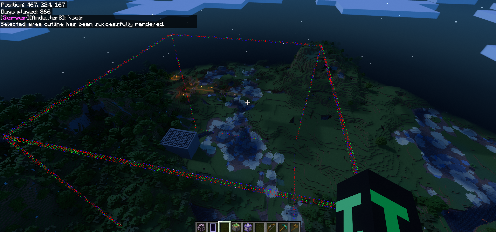

Renders the outline of the current selection.

It uses the same pos1 and pos2 particles that are used when using the [Selction Tool](../items/selection-tool).

It uses the pos1 particles for parts of the selection that are closer to the pos1 position, and uses the pos2 particles for parts of the selection that are closer to the pos2 position.

<CommandDetailsTable
    name="\selectionrender"
    :aliases="[
        '\\selrender',
        '\\selr'
    ]"
    :categories="[
        'world',
        'worldedit'
    ]"
    :requiredTags="[
        'canUseChatCommands'
    ]"
    ultraSecurityModeSecurityLevel="WorldEdit"
    version="1.0.0"
    :undoSupported="-1"
    :functional="true"
    :deprecated="false"
/>

## Syntax

`\selectionrender [duration: float[?=10]]`{lang=andexdbcmd}

<indent>Renders the outline of the current selection</indent>

## Arguments

<template-InDevelopment section="section" version="v1.35.0" />

`[duration: float[?=10]]`{lang=andexdbcmd}: [float](../commands/parameter-types#float)

<indent>

The duration of the particle effect in seconds.

Defaults to 10 seconds.

</indent>

## Result

Always succeeds.

## History

<table class="wikitable pixel-image bgType2" data-description="History">
    <tbody>
        <tr class="collapsible collapsible-rows">
            <th colspan="8" style="border-bottom: none">
                <!-- <a href="/w/Pocket_Edition_Alpha" title="Pocket Edition Alpha"> -->
                    Debug Sticks
                <!-- </a> -->
            </th>
        </tr>
        <tr class="collapsible-row">
            <th class="nowrap" rowspan="1" colspan="1">
                <!-- <a href="/changelogs/v1.?.0" title="Debug Sticks v1.?.0"> -->
                    ?
                <!-- </a> -->
            </th>
            <th colspan="4" rowspan="1">
                <!-- <a
                    href="/changelogs/v1.?.0"
                    title="Debug Sticks v1.?.0"
                > -->
                    ?
                <!-- </a> -->
            </th>
            <td>

Added `\selectionrender`{lang=acmd}.

</td>
        </tr>
        <tr class="collapsible collapsible-rows">
            <th colspan="8" style="border-bottom: none">
                <!-- <a href="/w/Pocket_Edition_Alpha" title="Pocket Edition Alpha"> -->
                    Upcoming Server Utilities
                <!-- </a> -->
            </th>
        </tr>
        <tr class="collapsible-row">
            <th class="nowrap" rowspan="1" colspan="1">
                <a href="/changelogs/v1.35.0" title="Server Utilities v1.35.0">
                    v1.35.0
                </a>
            </th>
            <th colspan="4" rowspan="1">
                <a
                    href="/changelogs/v1.35.0-rc.1"
                    title="Server Utilities v1.35.0-RC.1"
                >
                    RC1
                </a>
            </th>
            <td>

Added the duration parameter to `\selectionrender`{lang=acmd}.

</td>
        </tr>
    </tbody>
</table>
