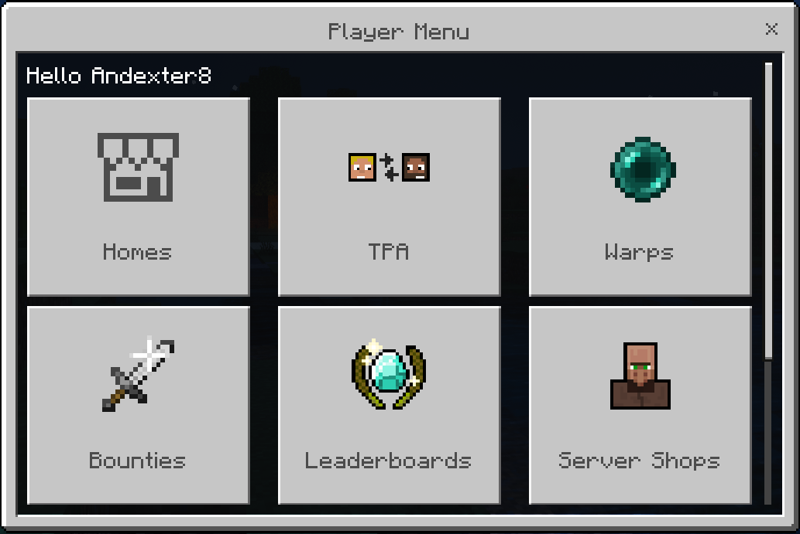

<template-Stub />

The player menu is like the [Main Menu](../main-menu/main-menu) but it is for regular players instead of admins.

It includes many features, such as:

-   [A homes system UI.](../systems/home)
-   [A TPA system UI.](../systems/tpa)
-   [A warps system UI.](./warps)
-   [A bounty system UI.](./bounties)
-   [A leaderboards UI.](./leaderboards)
-   [A button to access the Server Shops UI.](../systems/server-shop)
-   [A button to access the Player Shops UI.](../systems/player-shop)
-   [A money transfer system UI.](./money-transfer)
-   [A code redemption system UI.](./code-redemption) You can create codes that players can enter into this menu that give them a specific item when they enter it, and each person can only enter each code once.

The player menu can be accessed through either the [Player Menu](../items/player-menu) item, or the [`\playermenu`{lang=acmd}](../commands-list/-playermenu) command.

For information on how to customize the player menu, see [Player Menu Settings](../settings/uis/menu-configurations/player-menu).
