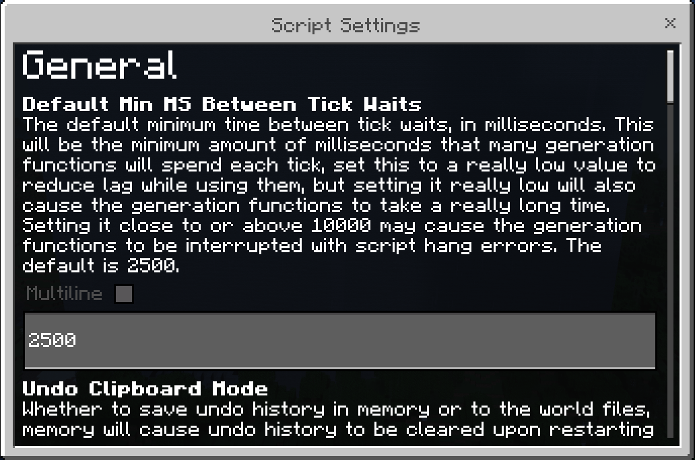
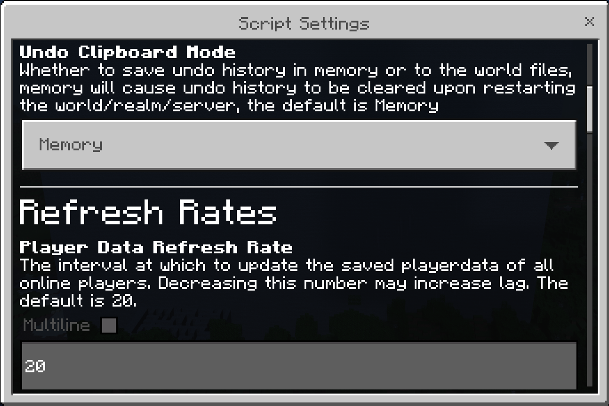
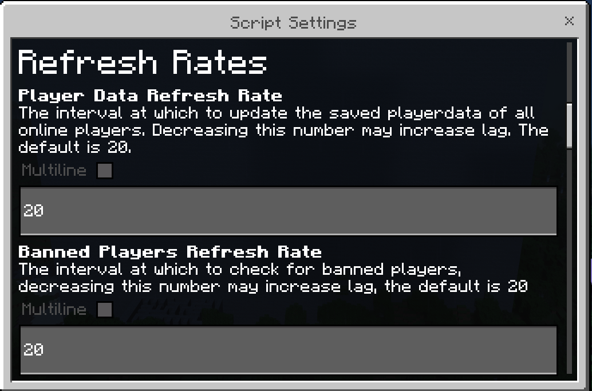
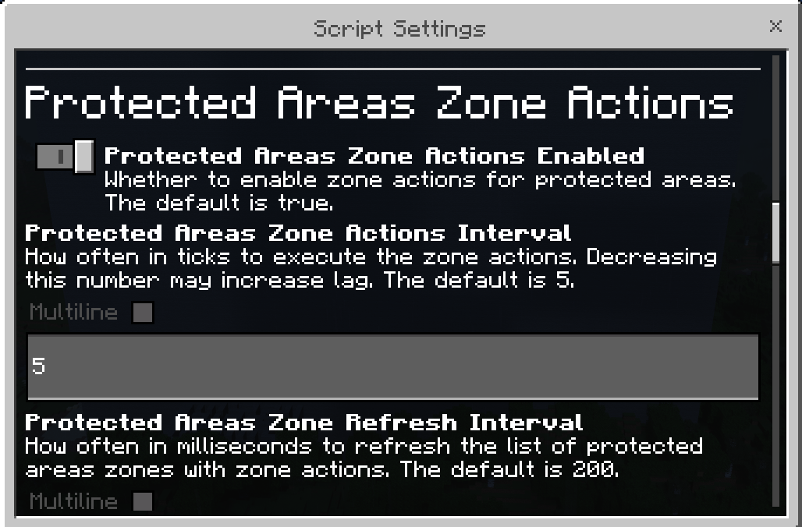
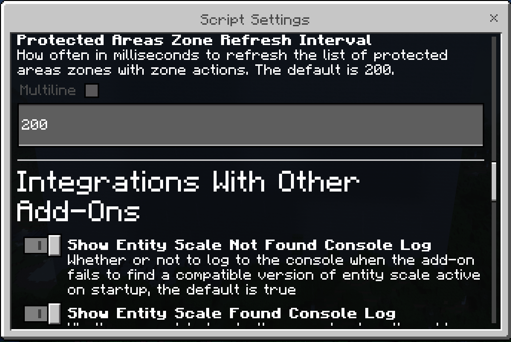
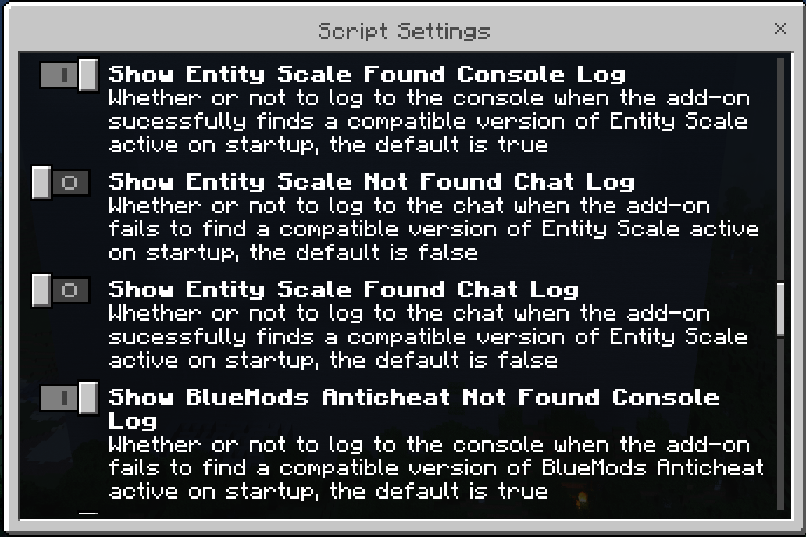
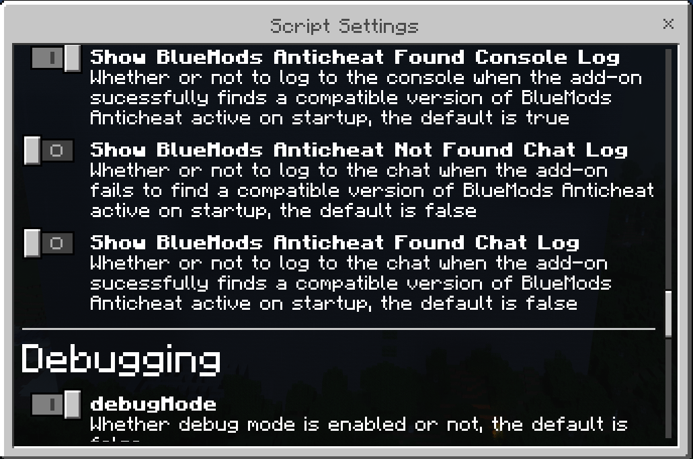
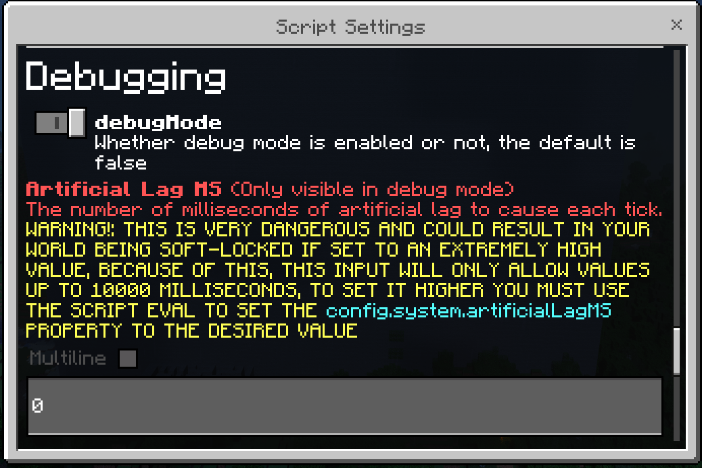
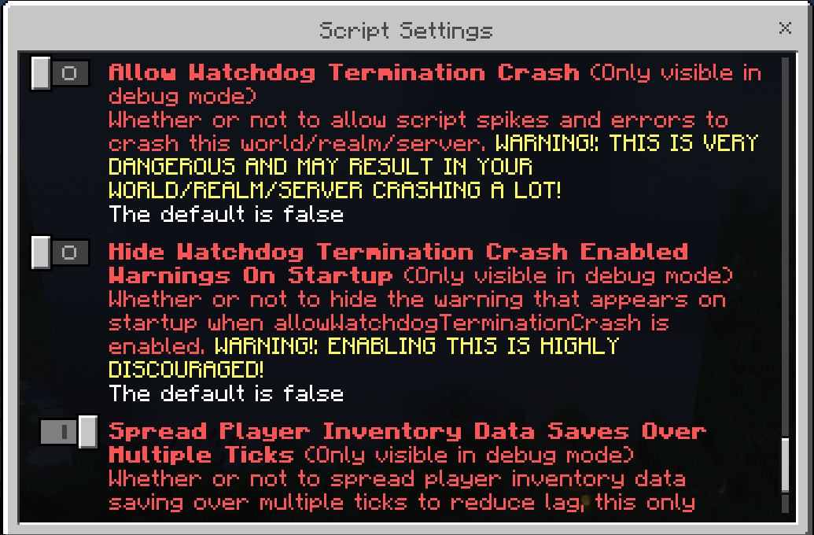
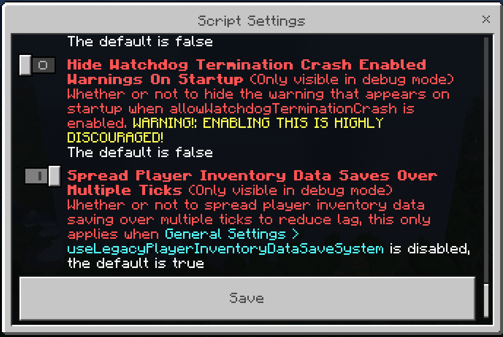

Path: `Main Menu > Settings > Script Settings`

This settings menu is for settings related to the internal workings of the add-on.

<Spoiler title="Images">

These images are from [`v1.35.0`](../changelogs/v1.35.0).

</Spoiler>

## Settings

### Default Min MS Between Tick Waits

<template-InDevelopment section="section" version="v1.35.0" />

The default minimum time between tick waits, in milliseconds.

This will be the minimum amount of milliseconds that many generation functions will spend each tick, set this to a really low value to reduce lag while using them, but setting it really low will also cause the generation functions to take a really long time.

Setting it close to or above 10000 may cause the generation functions to be interrupted with script hang errors.

Default: `2500`{lang=ts}

Config: [`config.system.defaultMinMsBetweenTickWaits`{lang=ts}](https://api.8crafter.com/andexdb/dev/classes/Globals.config.system.html#defaultminmsbetweentickwaits)

### Player Data Refresh Rate

The interval at which to update the saved playerdata of all online players. 

Decreasing this number may increase lag.

Default: `20`{lang=ts}

Config: [`config.system.playerDataRefreshRate`{lang=ts}](https://api.8crafter.com/andexdb/stable/classes/Globals.config.system.html#playerdatarefreshrate)

### Protected Areas Refresh Rate

<template-OutdatedFeature section="section" />

The interval at which to update list the saved protected areas.

Decreasing this number may increase lag.

Type: [`integer`](../commands/parameter-types#int)

Range: `1-1000`{lang=ts}

Default: `200`{lang=ts}

Config: [`config.system.protectedAreasRefreshRate`{lang=ts}](https://api.8crafter.com/andexdb/stable/classes/Globals.config.system.html#protectedareasrefreshrate)

### Protected Areas Zone Actions Enabled

<template-InDevelopment section="section" version="v1.35.0" />

Whether to enable zone actions for protected areas.

Default: `true`{lang=ts}

Config: [`config.system.protectedAreasZoneActionsEnabled`{lang=ts}](https://api.8crafter.com/andexdb/stable/classes/Globals.config.system.html#protectedareaszoneactionsenabled)

### Protected Areas Zone Actions Interval

<template-InDevelopment section="section" version="v1.35.0" />

How often in ticks to execute the zone actions.

Decreasing this number may increase lag.

Type: [`integer`](../commands/parameter-types#int)

Range: `1-1000000`{lang=ts}

Default: `5`{lang=ts}

Config: [`config.system.protectedAreasZoneActionsInterval`{lang=ts}](https://api.8crafter.com/andexdb/stable/classes/Globals.config.system.html#protectedareaszoneactionsinterval)

### Protected Areas Zone Refresh Interval

<template-InDevelopment section="section" version="v1.35.0" />

How often in milliseconds to refresh the list of protected areas zones with zone actions.

Changing this will have little to no performance impact.

Type: [`integer`](../commands/parameter-types#int)

Range: `1-1000000`{lang=ts}

Default: `200`{lang=ts}

Config: [`config.system.protectedAreasZoneRefreshInterval`{lang=ts}](https://api.8crafter.com/andexdb/stable/classes/Globals.config.system.html#protectedareaszonerefreshinterval)

### Show Entity Scale Not Found Console Log

Whether or not to log to the console when the add-on fails to find a compatible version of [Entity Scale](/../main/add-ons/entity-scale) active on startup.

Default: `true`{lang=ts}

Config: [`config.system.showEntityScaleNotFoundConsoleLog`{lang=ts}](https://api.8crafter.com/andexdb/stable/classes/Globals.config.system.html#showentityscalenotfoundconsolelog)

### Show Entity Scale Found Console Log

Whether or not to log to the console when the add-on sucessfully finds a compatible version of [Entity Scale](/../main/add-ons/entity-scale) active on startup.

Default: `true`{lang=ts}

Config: [`config.system.showEntityScaleFoundConsoleLog`{lang=ts}](https://api.8crafter.com/andexdb/stable/classes/Globals.config.system.html#showentityscalefoundconsolelog)

### Show Entity Scale Not Found Chat Log

Whether or not to log to the chat when the add-on fails to find a compatible version of [Entity Scale](/../main/add-ons/entity-scale) active on startup.

Default: `false`{lang=ts}

Config: [`config.system.showEntityScaleNotFoundChatLog`{lang=ts}](https://api.8crafter.com/andexdb/stable/classes/Globals.config.system.html#showentityscalenotfoundchatlog)

### Show Entity Scale Found Chat Log

Whether or not to log to the chat when the add-on sucessfully finds a compatible version of [Entity Scale](/../main/add-ons/entity-scale) active on startup.

Default: `false`{lang=ts}

Config: [`config.system.showEntityScaleFoundChatLog`{lang=ts}](https://api.8crafter.com/andexdb/stable/classes/Globals.config.system.html#showentityscalefoundchatlog)

### Show BlueMods Anticheat Not Found Console Log

<template-InDevelopment section="section" version="v1.35.0" />

Whether or not to log to the console when the add-on fails to find a compatible version of [BlueMods Anticheat](/../main/add-ons/bluemods-anticheat) active on startup.

Default: `true`{lang=ts}

Config: [`config.system.showBlueModsAnticheatNotFoundConsoleLog`{lang=ts}](https://api.8crafter.com/andexdb/stable/classes/Globals.config.system.html#showbluemodsanticheatnotfoundconsolelog)

### Show BlueMods Anticheat Found Console Log

<template-InDevelopment section="section" version="v1.35.0" />

Whether or not to log to the console when the add-on sucessfully finds a compatible version of [BlueMods Anticheat](/../main/add-ons/bluemods-anticheat) active on startup.

Default: `true`{lang=ts}

Config: [`config.system.showBlueModsAnticheatFoundConsoleLog`{lang=ts}](https://api.8crafter.com/andexdb/stable/classes/Globals.config.system.html#showbluemodsanticheatfoundconsolelog)

### Show BlueMods Anticheat Not Found Chat Log

<template-InDevelopment section="section" version="v1.35.0" />

Whether or not to log to the chat when the add-on fails to find a compatible version of [BlueMods Anticheat](/../main/add-ons/bluemods-anticheat) active on startup.

Default: `false`{lang=ts}

Config: [`config.system.showBlueModsAnticheatNotFoundChatLog`{lang=ts}](https://api.8crafter.com/andexdb/stable/classes/Globals.config.system.html#showbluemodsanticheatnotfoundchatlog)

### Show BlueMods Anticheat Found Chat Log

<template-InDevelopment section="section" version="v1.35.0" />

Whether or not to log to the chat when the add-on sucessfully finds a compatible version of [BlueMods Anticheat](/../main/add-ons/bluemods-anticheat) active on startup.

Default: `false`{lang=ts}

Config: [`config.system.showBlueModsAnticheatFoundChatLog`{lang=ts}](https://api.8crafter.com/andexdb/stable/classes/Globals.config.system.html#showbluemodsanticheatfoundchatlog)

### Debug Mode

Whether debug mode is enabled or not.

Default: `false`{lang=ts}

Config: [`config.system.debugMode`{lang=ts}](https://api.8crafter.com/andexdb/stable/classes/Globals.config.system.html#debugmode)

### Artificial Lag MS

::: danger
THIS IS OPTION VERY DANGEROUS AND COULD RESULT IN THE WORLD/REALM/SERVER BEING SOFT-LOCKED IF SET TO AN EXTREMELY HIGH VALUE!

If this happens please [contact 8Crafter](https://www.dev.8crafter.com/main/contact) and he will fix it.
:::

::: warning IMPORTANT
This option is only visible when [debug mode](#debug-mode) is enabled.
:::

The number of milliseconds of artificial lag to cause each tick.

Default: `0`{lang=ts}

Config: [`config.system.artificialLagMs`{lang=ts}](https://api.8crafter.com/andexdb/stable/classes/Globals.config.system.html#artificallagms)

### Allow Watchdog Termination Crash

::: danger
THIS IS VERY DANGEROUS AND MAY RESULT IN THE WORLD/REALM/SERVER CRASHING A LOT!
:::

::: warning IMPORTANT
This option is only visible when [debug mode](#debug-mode) is enabled.
:::

Whether or not to allow script spikes and errors to crash the world/realm/server.

Default: `false`{lang=ts}

Config: [`config.system.allowWatchdogTerminationCrash`{lang=ts}](https://api.8crafter.com/andexdb/stable/classes/Globals.config.system.html#allowwatchdogterminationcrash)

### Hide Watchdog Termination Crash Enabled Warnings On Startup

::: danger
ENABLING THIS IS HIGHLY DISCOURAGED!
:::

::: warning IMPORTANT
This option is only visible when [debug mode](#debug-mode) is enabled.
:::

Whether or not to hide the warning that appears on startup when allowWatchdogTerminationCrash is enabled.

Default: `false`{lang=ts}

Config: [`config.system.hideWatchdogTerminationCrashEnabledWarningsOnStartup`{lang=ts}](https://api.8crafter.com/andexdb/stable/classes/Globals.config.system.html#hidewatchdogterminationcrashenabledwarningsonstartup)

### Spread Player Inventory Data Saves Over Multiple Ticks

::: danger
This option may cause lag if disabled.
:::

::: warning IMPORTANT
This option is only visible when [debug mode](#debug-mode) is enabled.
:::

::: tip
This only applies when [`Main Menu > Settings > General Settings > Use Legacy Player Inventory Data Save System`](./general#use-legacy-player-inventory-data-save-system) is disabled.
:::

Whether or not to spread player inventory data saves over multiple ticks to reduce lag.

Default: `true`{lang=ts}

Config: [`config.system.spreadPlayerInventoryDataSavesOverMultipleTicks`{lang=ts}](https://api.8crafter.com/andexdb/stable/classes/Globals.config.system.html#spreadplayerinventorydatasavesovermultipleticks)

## History

<template-EmptySection />
