:::warning

This page only applies to versions v1.33.0 to v1.34.x of the add-on.

If you are using a version prior to v1.33.0, please see the [TPA System (Pre 1.33.0)](<../systems/tpa_(Pre_1.33.0)>) page.

If you are using v1.35.0 or newer, please see the [TPA System](../systems/tpa) page.

:::

Any player can use the TP request system, regardless of permissions.

The TP request system can be disabled in settings, but it is enabled by default.

## How to enable or disable the TPA system

1. Open the [Main Menu](../main-menu/main-menu) (use the [`\mainmenu`{lang=acmd}](../commands-list/-mainmenu.md) command or the [Main Menu stick](../items/main-menu)).
2. Click "Settings".

    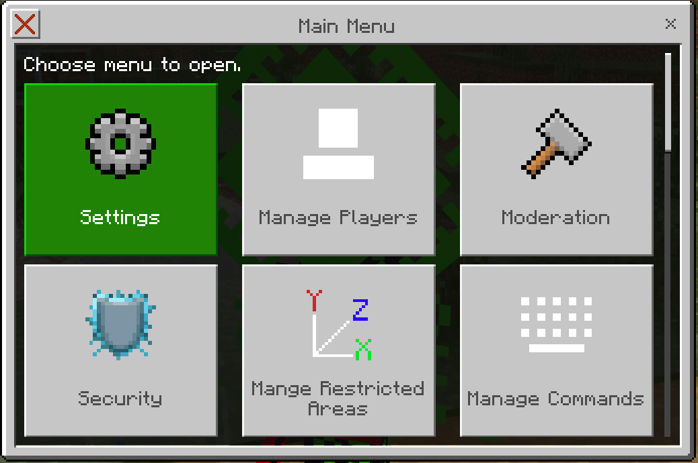

3. Scroll down and click "TPA System Settings".

    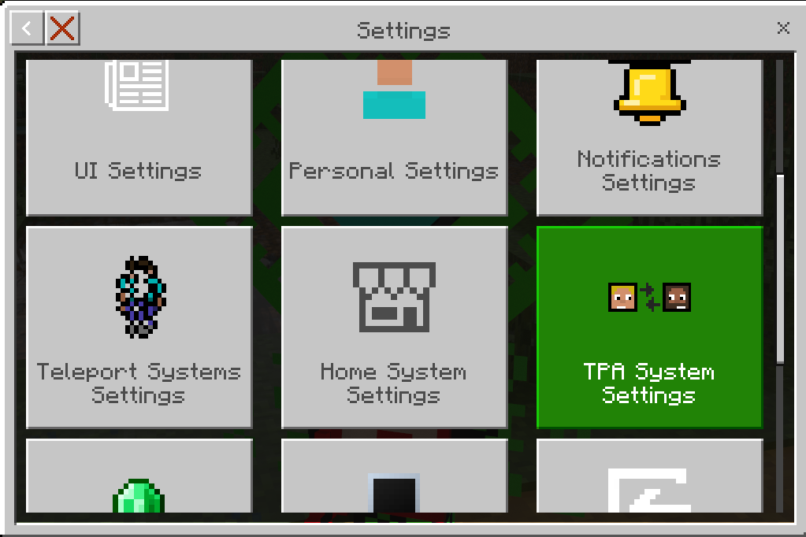

4. Enable or disable the [`Enable TPA System`](../settings/tpa-system#enable-tpa-system) toggle.

    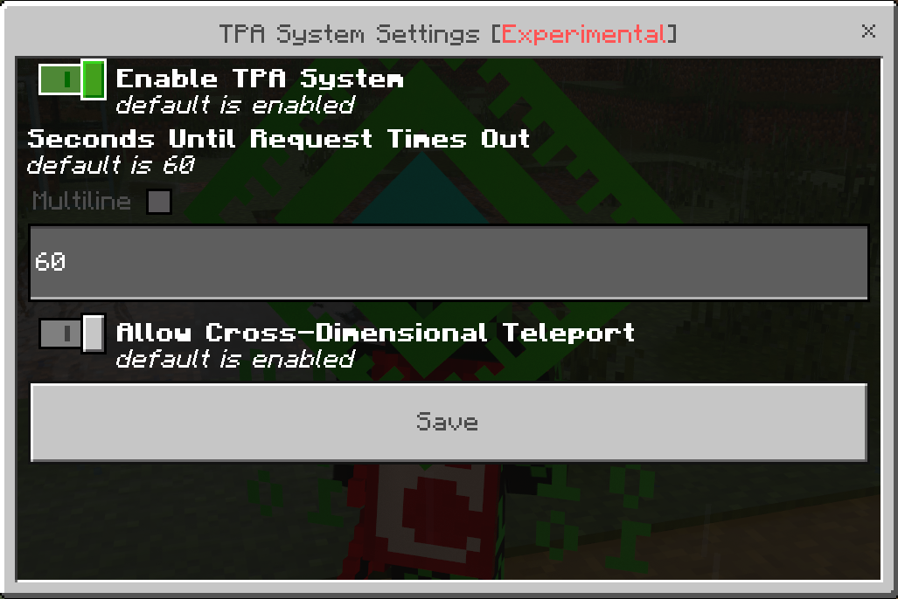

5. Click the "Save" button.

    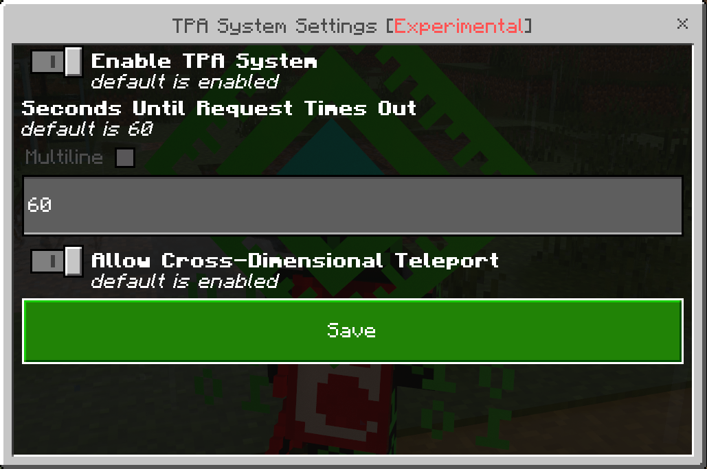

## How to use the TPA/teleport request system

### Sending a teleport request

#### Option 1: Using a command

Use the [`\tpa <player: target>`{lang=acmd}](../commands-list/-tpa) command (ex. ` `{lang=mccommand noRightCodeBlock=true}[`\tpa`{lang=mccommand noLeftCodeBlock=true noRightCodeBlock=true}](../commands-list/-tpa) `Andexter8`{lang=mccommand noLeftCodeBlock=true} or ` `{lang=mccommand noRightCodeBlock=true}[`\tpa`{lang=mccommand noLeftCodeBlock=true noRightCodeBlock=true}](../commands-list/-tpa) `@r`{lang=mccommand noLeftCodeBlock=true}).

#### Option 2: Using the player menu

1. Open the player menu (use the [`\playermenu`{lang=acmd}](../commands-list/-playermenu.md) command or the [Player Menu](../items/player-menu) item).
2. Click "TPA".

    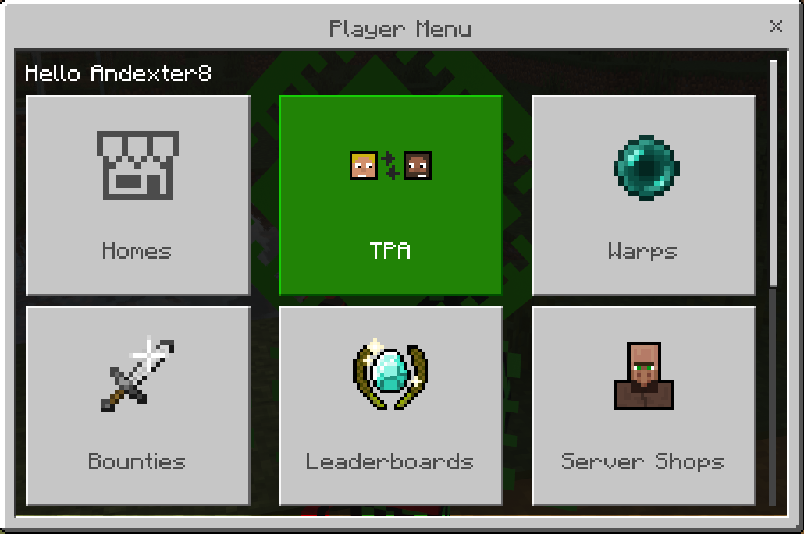

3. Click "Send Teleport Request".

    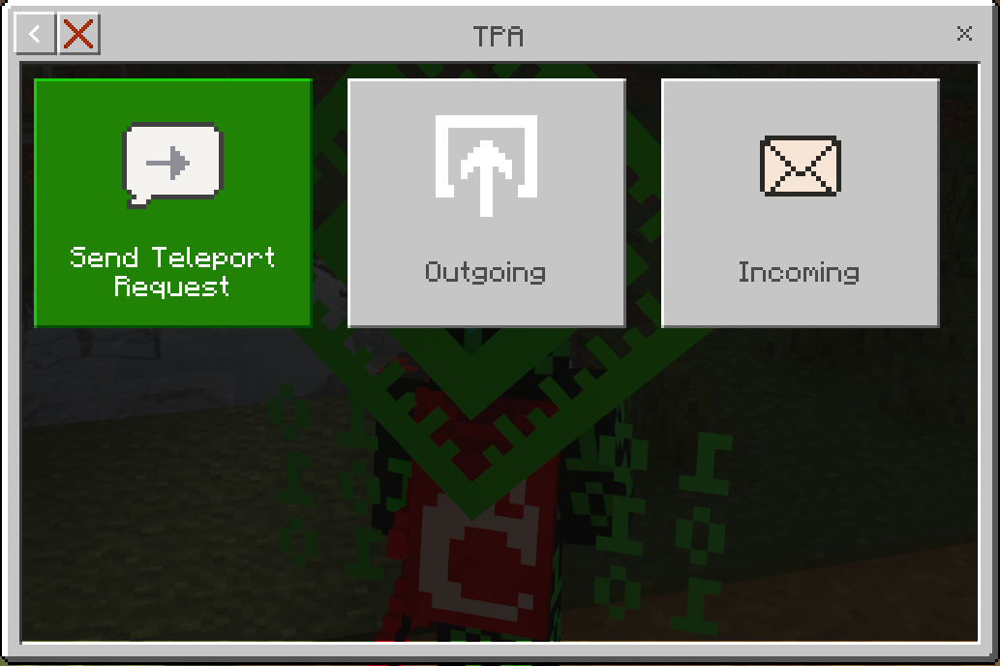

4. Select the player to teleport to.

    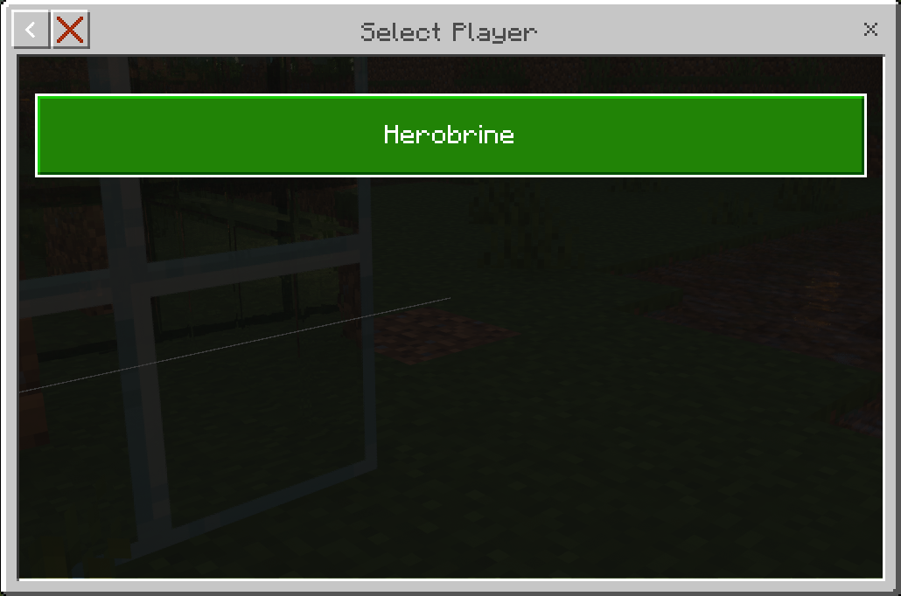

### Accepting a teleport request

#### If the request was sent using the [`\tpa`{lang=mccommand}](../commands-list/-tpa) command

1. Type "y" in the chat.

#### If the request was sent using the player menu

1. Open the player menu (use the [`\playermenu`{lang=acmd}](../commands-list/-playermenu.md) command or the [Player Menu](../items/player-menu) item).
2. Click "TPA".

    

3. Click "Incoming".

    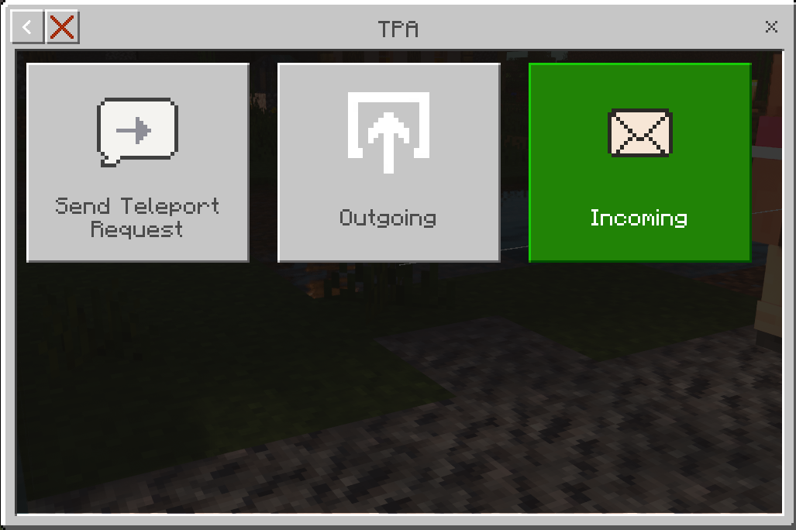

4. Select the player you want to accept the teleport request from.

    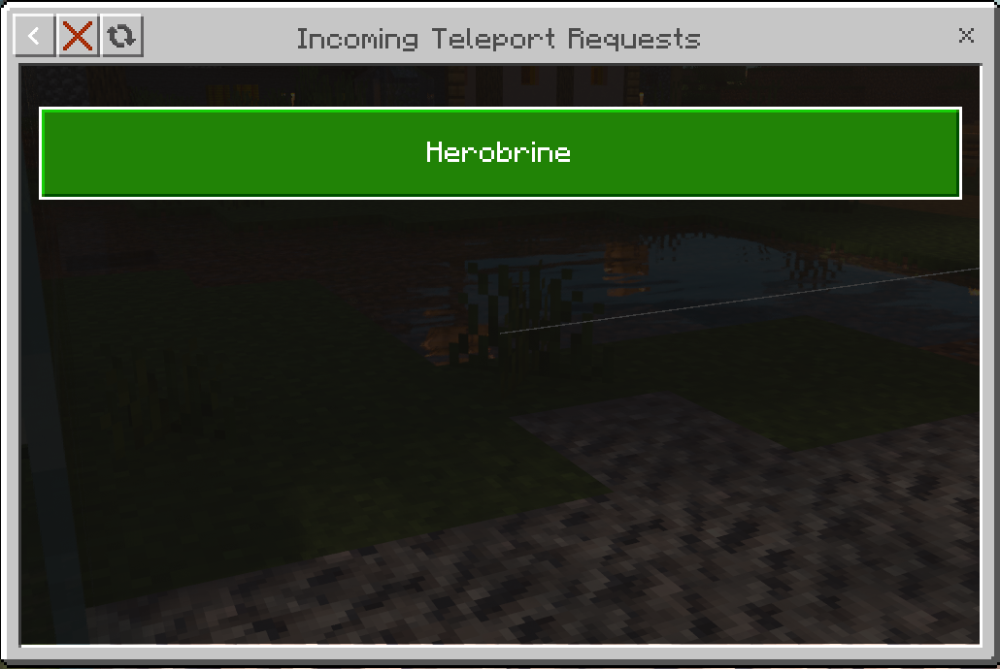

5. Click "Accept Request".

    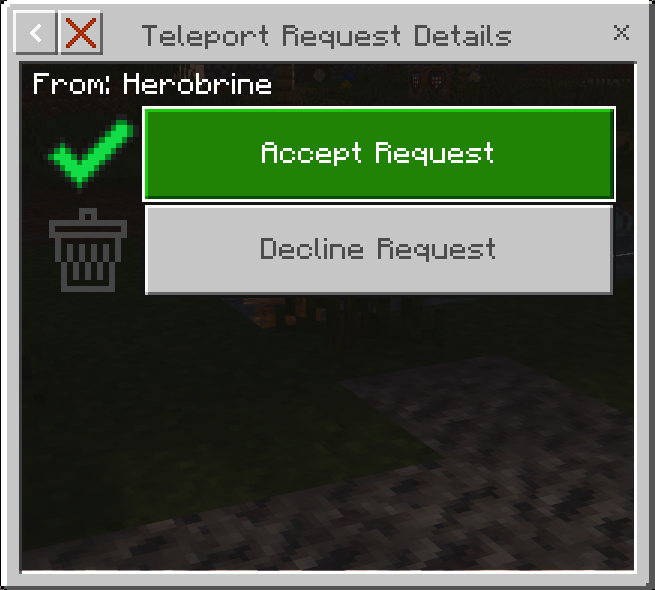

### Declining a teleport request

#### If the request was sent using the [`\tpa`{lang=mccommand}](../commands-list/-tpa) command

1. Type "n" in the chat.

#### If the request was sent using the player menu

1. Open the player menu (use the [`\playermenu`{lang=acmd}](../commands-list/-playermenu.md) command or the [Player Menu](../items/player-menu) item).
2. Click "TPA".

    

3. Click "Incoming".

    

4. Select the player you want to decline the teleport request from.

    

5. Click "Decline Request".

    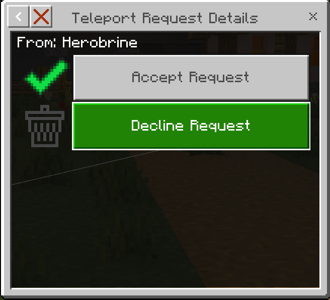

## Configuration Options

-   You can change the [amount of time before a teleport request times out](../settings/tpa-system#seconds-until-teleport-request-times-out) in settings (Main Menu > Settings > TPA System Settings).
-   You can configure a [PVP cooldown](../settings/teleport-systems#pvp-cooldown-to-teleport) in settings, this will cause the players to be unable to use any of the teleport commands (ex. [`\tpa`{lang=acmd}](../commands-list/-tpa), [`\spawn`{lang=acmd}](../commands-list/-spawn), and [`\home`{lang=acmd}](../commands-list/-home)) for the specified amount of time after they are hit by another player (Main Menu > Settings > Teleport Systems Settings).
-   You can configure a [Teleport Cooldown](../settings/teleport-systems#teleport-cooldown) in settings, this will cause the players to be unable to teleport for the specified amount of time after they teleport (Main Menu > Settings > Teleport Systems Settings).
-   You can configure a [Stand Still Duration](../settings/teleport-systems#stand-still-time-to-teleport) in settings, this will cause the players to have to stand still for the specified amount of time before they can teleport, if they move then the teleportation will be canceled (Main Menu > Settings > Teleport Systems Settings).
